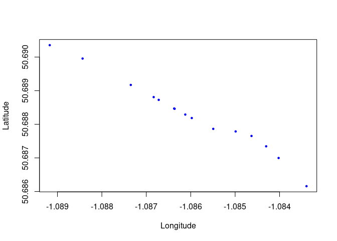

<!-- README.md is generated from README.Rmd. Please edit that file -->

# net4routing

<!-- badges: start -->

<!-- badges: end -->

The goal of net4routing is to prepare route networks, imported from
OpenStreetMap or other sources, for routing with `cppRouting` and other
packages.

## Installation

You can install the development version of net4routing from
[GitHub](https://github.com/) with:

``` r
# install.packages("pak")
pak::pak("r-transport/net4routing")
```

## Example

``` r
library(net4routing)
# Download a network:
region_name = "isle of wight"
pbf_info = osmextract::oe_match(region_name)
#> The input place was matched with: Isle of Wight
pbf_url = pbf_info$url
pbf_file = osmextract::oe_download(pbf_info$url)
#> The chosen file was already detected in the download directory. Skip downloading.
res = nr_osm4routing(pbf_file)
```

We’ll now make a graph with cppRouting:

``` r
library(cppRouting)
# Load the network
nodes = readr::read_csv(res[1]) |>
  dplyr::transmute(
    ID = id, X = lon, Y = lat
  ) |>
  as.data.frame()
#> Rows: 42852 Columns: 3
#> ── Column specification ────────────────────────────────────────────────────────
#> Delimiter: ","
#> dbl (3): id, lon, lat
#> 
#> ℹ Use `spec()` to retrieve the full column specification for this data.
#> ℹ Specify the column types or set `show_col_types = FALSE` to quiet this message.
edges = readr::read_csv(res[2]) |>
  dplyr::transmute(
    from = source, to = target, weight = length
  ) |>
  as.data.frame()
#> Rows: 51940 Columns: 12
#> ── Column specification ────────────────────────────────────────────────────────
#> Delimiter: ","
#> chr (8): id, foot, car_forward, car_backward, bike_forward, bike_backward, t...
#> dbl (4): osm_id, source, target, length
#> 
#> ℹ Use `spec()` to retrieve the full column specification for this data.
#> ℹ Specify the column types or set `show_col_types = FALSE` to quiet this message.
graph = cppRouting::makegraph(edges, coords = nodes)
str(graph)
#> List of 5
#>  $ data  :'data.frame':  51940 obs. of  3 variables:
#>   ..$ from: int [1:51940] 0 1 0 2 3 4 5 6 7 8 ...
#>   ..$ to  : int [1:51940] 1 211 2 3 4 5 6 7 8 9 ...
#>   ..$ dist: num [1:51940] 14.6 39.1 104.1 43.5 41.5 ...
#>  $ coords:'data.frame':  42852 obs. of  3 variables:
#>   ..$ ID: chr [1:42852] "255734" "5339263635" "255733" "765635519" ...
#>   ..$ X : num [1:42852] -1.08 -1.08 -1.08 -1.08 -1.08 ...
#>   ..$ Y : num [1:42852] 50.7 50.7 50.7 50.7 50.7 ...
#>  $ nbnode: int 42852
#>  $ dict  :'data.frame':  42852 obs. of  2 variables:
#>   ..$ ref: chr [1:42852] "255734" "5339263635" "255733" "765635519" ...
#>   ..$ id : int [1:42852] 0 1 2 3 4 5 6 7 8 9 ...
#>  $ attrib:List of 4
#>   ..$ aux  : NULL
#>   ..$ cap  : NULL
#>   ..$ alpha: NULL
#>   ..$ beta : NULL
# List of 5
#  $ data  :'data.frame': 51940 obs. of  3 variables:
#   ..$ from: int [1:51940] 0 1 0 2 3 4 5 6 7 8 ...
#   ..$ to  : int [1:51940] 1 211 2 3 4 5 6 7 8 9 ...
#   ..$ dist: num [1:51940] 14.6 39.1 104.1 43.5 41.5 ...
#  $ coords:'data.frame': 42852 obs. of  3 variables:
#   ..$ ID: chr [1:42852] "255734" "5339263635" "255733" "765635519" ...
#   ..$ X : num [1:42852] -1.08 -1.08 -1.08 -1.08 -1.08 ...
#   ..$ Y : num [1:42852] 50.7 50.7 50.7 50.7 50.7 ...
#  $ nbnode: int 42852
#  $ dict  :'data.frame': 42852 obs. of  2 variables:
#   ..$ ref: chr [1:42852] "255734" "5339263635" "255733" "765635519" ...
#   ..$ id : int [1:42852] 0 1 2 3 4 5 6 7 8 9 ...
#  $ attrib:List of 4
#   ..$ aux  : NULL
#   ..$ cap  : NULL
#   ..$ alpha: NULL
#   ..$ beta : NULL
```

You can now use this graph to find the shortest path between two points:

``` r
# Find the shortest path between two points
from = "255734"
to = "255738"
shortest_path = cppRouting::get_path_pair(
  graph,
  from = from,
  to = to
)
shortest_path
#> $`255734_255738`
#>  [1] "255734"      "255733"      "765635519"   "279387"      "540707"     
#>  [6] "3792504678"  "10760063960" "10760063953" "4580466911"  "10760063950"
#> [11] "2306536"     "2306537"     "2387732"     "4339515020"  "255738"
# $`255734_255738`
#  [1] "255734"      "255733"      "765635519"   "279387"      "540707"     
#  [6] "3792504678"  "10760063960" "10760063953" "4580466911"  "10760063950"
# [11] "2306536"     "2306537"     "2387732"     "4339515020"  "255738"  
# Check all are in the edge list
summary(shortest_path[[1]] %in% nodes$ID)
#>    Mode    TRUE 
#> logical      15
nodes_edges = nodes[nodes$ID %in% shortest_path[[1]], ]
# Plot them:
plot(
  nodes_edges$X, nodes_edges$Y,
  pch = 19, col = "blue", cex = 0.5,
  xlab = "Longitude", ylab = "Latitude"
)
```



``` r
set.seed(123)
demand = data.frame(
  from = sample(nodes$ID, 5000, replace = TRUE),
  to = sample(nodes$ID, 5000, replace = TRUE),
  demand = runif(5000, 1, 10)
)
aon = cppRouting::get_aon(
  graph,
  from = demand$from,
  to = demand$to,
  demand = demand$demand,
)
head(aon)
#>         from         to       cost     flow
#> 1     255734 5339263635  14.574853 10.08537
#> 2     255734     255733 104.135236 30.97645
#> 3 5339263635   20698658  39.082445 10.08537
#> 4 5339263635 5339263634  36.987336  0.00000
#> 5     255733  765635519  43.474516 30.97645
#> 6     255733 6164333434   9.375004  0.00000
```

# Development

To format code for the package, install and format with `air`:

``` sh
curl -LsSf https://github.com/posit-dev/air/releases/latest/download/air-installer.sh | sh
air format .
```

Check the package with:

``` r
devtools::check()
```
